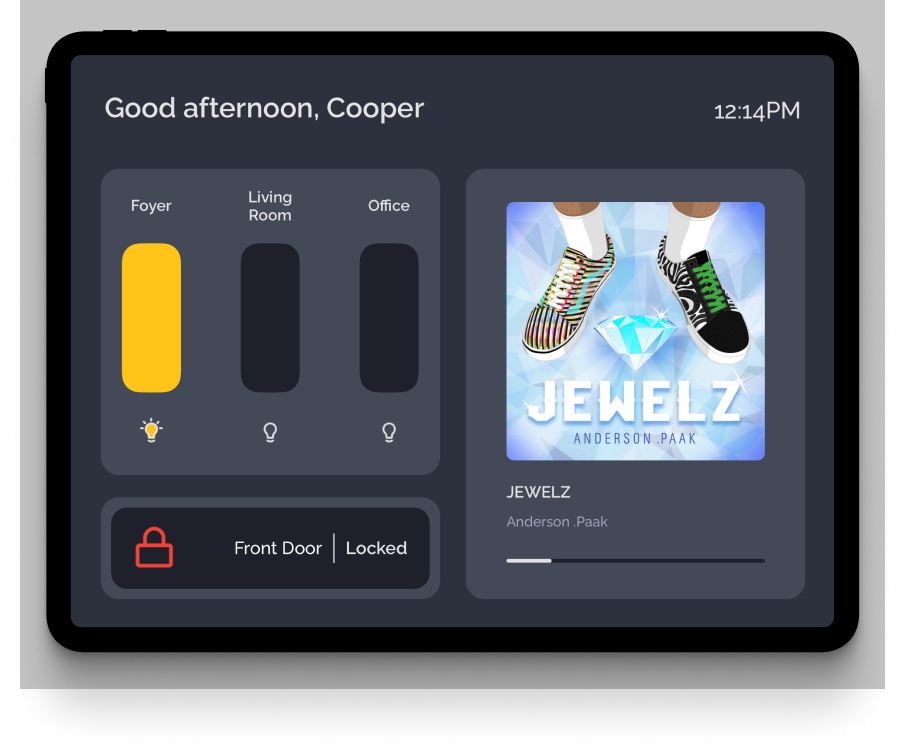

# HomeHub
iPad app to control my home's smart devices + show spotify current playback.

Written in Swift 5 using UIKit and the [Model-View-ViewModel](https://en.wikipedia.org/wiki/Model%E2%80%93view%E2%80%93viewmodel) design pattern.

I created this app for a few reasons:
- as a way to take a mental break from my larger project, [listMaven](https://apps.apple.com/us/app/listmaven/id1528191547)
- When friends are over they cannot control these lights themselves, so this gives them an easy way to do it
- and because I didn't like using August's app with their unusally poor UI/UX.

This app is akin to a [home-cooked meal](https://www.robinsloan.com/notes/home-cooked-app/) (s/o [@bmitchinson](https://github.com/bmitchinson)), meaning that it's just for my own use, is not customizable, and is essentially done besides bug fixes and updates as I see fit.

## Components:

### Lights

The lights are Phillips Hue A19 white-light dimmable bulbs. I am using the [SwiftyHue](https://github.com/Spriter/SwiftyHue) library to control them. Every few seconds it polls the lights' state; Changing the slider values or tapping the light bulb icon submits a new light level to the phillips api.

### Lock

The lock is an [August Wi-Fi Smart Lock](https://august.com/products/august-wifi-smart-lock). I am using Alamofire to hit their [unpublished api endpoints](https://nolanbrown.medium.com/august-lock-rest-apis-the-basics-7ec7f31e7874) and so far it's working. Every few seconds it polls lock state; Tapping the button submits a request to lock/unlock.

### Music

I hooked up my Spotify account using this awesome [library](https://github.com/Peter-Schorn/SpotifyAPI). Like the other components, it polls what's currently playing every few seconds, showing the album image, track name, artists, and song progression. Supports an empty state when nothing is playing.
